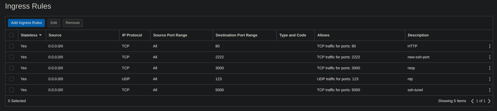
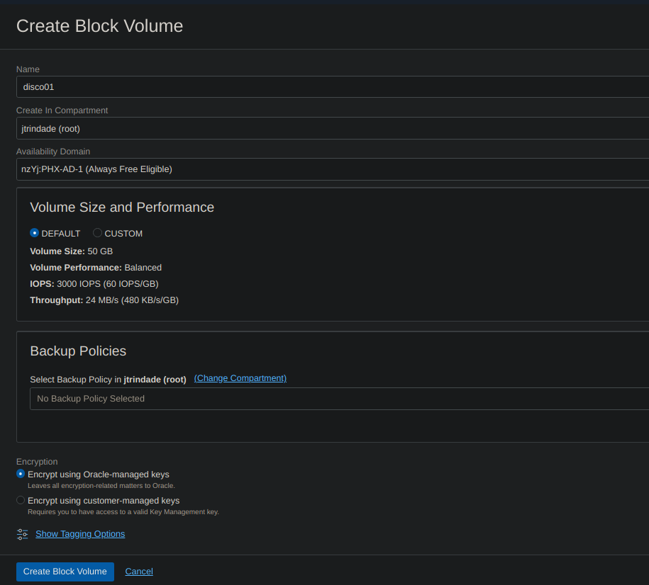
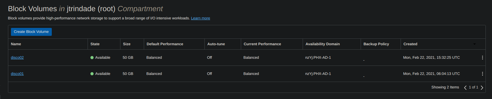
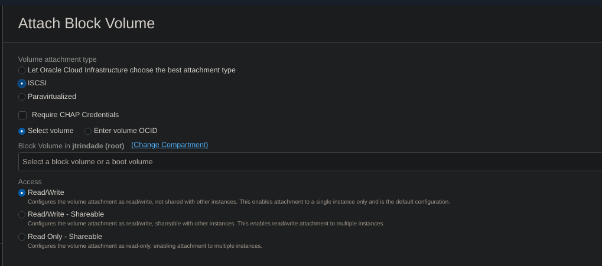
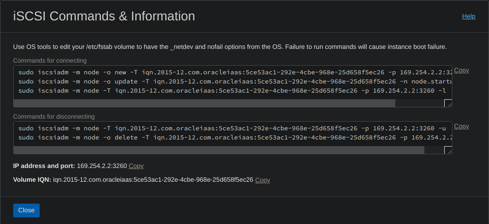

# Oracle Cloud Infrastructure - 4750

## Provisionando infraestrutura para o curso

Após a criação das instâncias, podemos usar o repositório que contém os arquivos e scripts necessários para o curso.

Execute os seguintes comandos como usuário administrador, de acordo com cada sistema.


### Ubuntu
```bash

cd /opt
sudo apt update
sudo apt install git -y
git clone https://github.com/4linux/files-oci-4linux.git
sudo bash /opt/files-oci-4linux/ubuntu/provision.sh
```

### CentOS
```bash

cd /opt
sudo  yum install git -y
git clone https://github.com/4linux/files-oci-4linux.git
sudo bash /opt/files-oci-4linux/centos/provision.sh
```

Pronto suas máquinas já estão preparadas para o curso!

## Criando regras para Subnets

As regras para publicação de portas não são feitas de forma automática, é necessário criá-las para acesso externo.

Para isso acesse Core Infra -> Networking -> Virtual Cloud Networks -> VNC padrão -> Subnet -> Security Lists.



### Lista de Portas

Protocolo | Destination Port | Service
 -------- |  --------------  | -----
 TCP      |  80              | Wordpress
 TCP      |  3000            | ntopng
 TCP      |  5000            | Tunel SSH
 UDP      |  123             | ntp
 UDP      |  514             | rsyslog
 TCP      |  2222            | sshd_config


## Adicionando disco na instância 

Para vincular discos nas instâncias, precisamos criar volumes block, no menu block storage do painel.

Para isso acesse Core Infra -> Block Storage -> Block Volumes -> Create Block Volume.



Após a criação do volume block já podemos acessá-lo em Core Infra -> Block Volumes.



Acessando o disco01 -> Attached Instances -> Attach to Instance -> Attach Block Volume.
Nesta parte podemos selecionar uma das instâncias já criadas e vincular nosso Block Volume. Lembrando que é apenas um por instância na conta trial.



*Obs: Selecione o disco01 em Select Volume*

Feito isso podemos executar os comandos gerados, para conectar no disposítivo ISCSI em Attach Block Volume -> disco01 -> ISCSI Commands & Information.



*Obs: Os comandos são gerados de acordo com cada dispositivo ISCSI criado.*

\
Executando os comandos ISCSI, podemos listar o novo dispositivo em nosso sistema.

```bash
root@instance-20210222-0152:~# lsblk
NAME    MAJ:MIN RM  SIZE RO TYPE MOUNTPOINT
loop0     7:0    0 55.4M  1 loop /snap/core18/1944
loop1     7:1    0 69.8M  1 loop /snap/lxd/19032
loop2     7:2    0 39.3M  1 loop /snap/oracle-cloud-agent/10
loop3     7:3    0 31.1M  1 loop /snap/snapd/10707
loop4     7:4    0 55.5M  1 loop /snap/core18/1988
loop5     7:5    0 31.1M  1 loop /snap/snapd/11036
loop6     7:6    0 69.9M  1 loop /snap/lxd/19188
loop7     7:7    0 40.2M  1 loop /snap/oracle-cloud-agent/13
sda       8:0    0 46.6G  0 disk 
├─sda1    8:1    0 46.5G  0 part /
├─sda14   8:14   0    4M  0 part 
└─sda15   8:15   0  106M  0 part /boot/efi
sdb       8:16   0   50G  0 disk 
```


